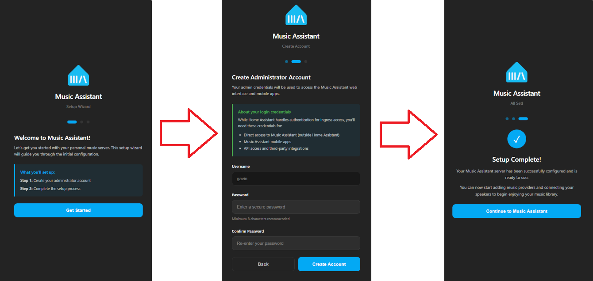

# Initial Authentication Setup

Access to the Music Assistant User Interface (UI) requires a login and password.

Upon first startup, what the the user is presented with depends upon the installation type and access method. If the Music Assistant server was installed as an add-on to Home Assistant and the MA UI was accessed via HA Ingress then an administrator account will be automatically setup in Music Assistant and the user will be taken straight to the settings page. In all other circumstances the user will be presented with an initial authentication setup dialog. It is very important that the administrator user and password, which is the first to be set up, is not forgotten as there is no way to obtain this later. If these are forgotten then the MA server will need to be rebuilt (docker users can delete auth.db).

The initial authentication setup dialog will appear as follows

{ width=256 }

After successfully logging in, the first required action for the administrator is to add providers for [music sources](music-providers/index.md) and [players](player-support/index.md). This banner is shown to support this

