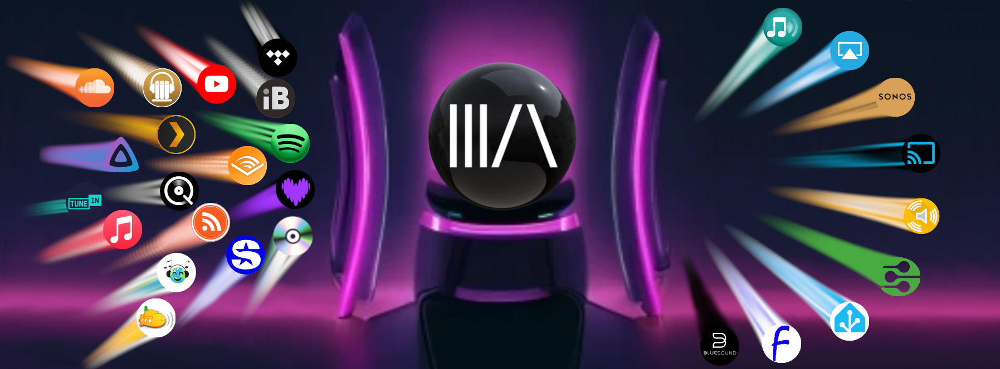

# Music Assistant

Music Assistant is a music library manager for your offline and online music sources which can easily stream your favourite music to a wide range of supported players and be combined with the power of Home Assistant!

## Features

- Supports multiple music sources through a provider implementation
- Many popular streaming services are supported, as well as local files
- Automatically matches music on different providers (track linking)
- Fetches metadata for extended artist information
- Keeps track of the entire music library in a compact database
- Gapless, crossfade and volume normalization support for all players
- Playback synchronisation is possible for supported players
- Announcements during playback supported
- Transfer of playback between players supported
- Truly hassle free streaming of your favourite music to players, no advanced knowledge required
- Rich User interface (Progressive Web App) powered by {width=20 }VueJS 3

## Architecture

Music Assistant consists of multiple building blocks:

- Music Assistant Server ([Installation Instructions](installation.md))
- Home Assistant Integration ([Installation Instructions](integration/installation.md))
- [Music Providers](music-providers/index.md): Import your music from various sources into Music Assistant.
- [Player Providers](player-support/index.md): Play your music on a wide collection of player ecosystems.
- Plugins: These extend the functionality of Music Assistant. Importantly, the [Home Assistant Plugin](ha-plugin.md) allows the importing of Home Assistant media players into the Music Assistant engine to use as targets for playback

## Music Assistant Server

The Music Assistant server is a free, opensource Media library manager that connects to your streaming services and a wide range of connected speakers. The server is the beating heart, the core of Music Assistant and it keeps track of your music sources. It must run on an always-on device like a Raspberry Pi, a NAS or an Intel NUC or alike. The server can access multiple music providers and stream to multiple player types.

## Home Assistant Integration

Connects Home Assistant to your Music Assistant Server to allow control from your HA instance, allow you to automate your music and allows voice control! The Integration also allows the exposure of HA media players to MA furthering the options you have for playback.

## Preview

[{ width=800 }](assets/screenshots/screen2.png)

??? note "Click to show more screenshots"

    [{ width=800 }](assets/screenshots/screen3.png)

    [{ width=800 }](assets/screenshots/screen1.png)

## The Core Team
 
[{ width=100 }](https://github.com/marcelveldt "Marcel. Creator of Music Assistant")
[{ width=100 }](https://github.com/marvinschenkel "Marvin. Project Lead. Author of the YouTube and Apple Music providers")
[{ width=100 }](https://github.com/maximmaxim345 "Maxim. DSP Guru and Core Developer")

[{ width=100 }](https://github.com/OzGav "Gavin. Community Support, Documentation and Core Developer")
[{ width=100 }](https://github.com/jozefKruszynski "Jozef. Author of the Tidal provider and Core Developer")
[{ width=100 }](https://github.com/fmunkes "Fabian. Author of the Audiobookshelf, iTunes Podcast Search and gPodder providers and Core Developer")
[{ width=100 }](https://github.com/khers "Eric. Author of the Subsonic provider")

[{ width=100 }](https://github.com/santiagosotoc "Santiago. Author of the Snapcast provider")
[{ width=100 }](https://github.com/robsonke "Rob. Author of the iBroadcast provider and maintainer of Soundcloud")
[{ width=100 }](https://github.com/arctixdev "Jonathan. Author of the Deezer provider and the Companion App")
[{ width=100 }](https://github.com/jc2k "John. Jellyfin Maintainer and Core Developer")

We also give THANKS to all the other contributors to the [Server](https://github.com/music-assistant/server/graphs/contributors), [Frontend](https://github.com/music-assistant/frontend/graphs/contributors), [Voice Support](https://github.com/music-assistant/voice-support/graphs/contributors) and all of the [Repositories](https://github.com/orgs/music-assistant/repositories?type=all) that make up this project!

[repository-badge]: https://img.shields.io/badge/Add%20repository%20to%20my-Home%20Assistant-41BDF5?logo=home-assistant&style=for-the-badge
[repository-url]: https://my.home-assistant.io/redirect/supervisor_add_addon_repository/?repository_url=https%3A%2F%2Fgithub.com%2Fmusic-assistant%2Fhome-assistant-addon

