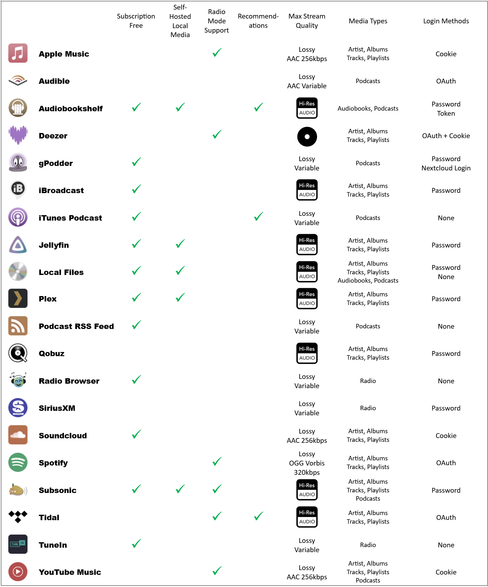

# Music Providers
<figure markdown>
  
</figure>

For specific music provider information refer to the relevant section.

General Notes:

- You have to add providers in order to access your music even if the media is visible to HA.
- If you remove a provider a cleanup of the database will be done but it takes a little time to complete. If you still see entries from a deleted provider after some time, then try a MA restart to retrigger the cleanup process.
- Music providers are added by navigating to MA Settings and then clicking on ADD MUSIC PROVIDER at the top of the page

!!! tip "Note" 
    If a problem occurs the automatic linking process may need to be initiated again. If what appears to be identical albums or tracks are seen then navigate to the album or track and using the ⋮ menu in the banner at the top of the view select "Refresh Item". This will trigger the linking process and should result in the same albums and tracks being collapsed together. Submit an issue report if this is required so that it can be investigated.

## Settings

All Music Providers have settings which can be configured. The settings page will look similar to the following. The text `Check out the documentation` is a hyperlink to the relevant page in this documentation. Specific help for a setting or configurable field is often available and is accessed by selecting this icon . All providers can be given a custom name and disabled if necessary. The log level can be adjusted for all providers and this is found in the advanced settings. (Do not select Verbose unless asked for by a dev as it can have an adverse performance impact). See the provider pages for provider specific settings.

## Summary

The table below provides an at-a-glance summary of all of the music providers. Green ticks indicate a desirable quality or function is available. 

Stream quality is indicated as either [Hi-Res](../player-support/index.md/#audio-quality), [CD quality](https://www.soundguys.com/high-bitrate-audio-is-overkill-cd-quality-is-still-great-16518/) or lossy with the codec and bitrate where available.

The most user friendly login method is a password, followed by [OAuth](https://en.wikipedia.org/wiki/OAuth) and then the cookie method is least desirable.

