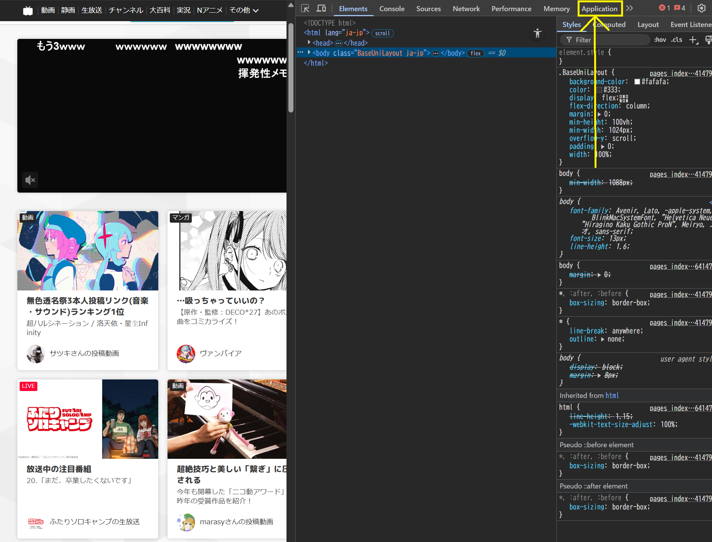

# Nico Nico Provider { width=70 align=right }

Music Assistant has support for [Nico Nico Video](nicovideo.jp), a Japanese video-sharing website similar to YouTube, famous for its on-screen scrolling comments that overlay the video. Contributed and maintained by [柴田 Shi-553](https://github.com/Shi-553)

## Features

|           |                     |
|:-----------------------|:---------------------:|
| Subscription FREE | Yes |
| Self-Hosted Local Media | No |
| Media Types Supported | Artists, Albums, Tracks, Playlists |
| [Recommendations](../ui.md#view-home) Supported | Yes |
| Lyrics Supported | No |
| [Radio Mode](../ui.md#track-menu) | Yes |
| Maximum Stream Quality | Lossy, AAC (up to ~576 kbps) |
| Login Method | Cookie or Password+MFA |

### Other

- Allows searching, playback, and library integration
- Keyword search for Tracks, Playlists (Mylist), and Albums (Series)
- Recommendations based on history and follow activity
- Library support
    - Playlists: your own Mylist (read/write)
    - Artists: your following artists

## Configuration

Music Assistant supports login-free playback and search on Niconico.
Logging in enables personal features such as recommendations, Mylist read/write, and watch history.

Two authentication methods are available:
- Cookie (user_session)
- Email + Password (+ MFA)

### Cookie Authentication (user_session)

Written for Chrome:

1. Navigate to https://www.nicovideo.jp/
2. Go to View > Developer > Developer Tools. A new side window will open.
3. Click the 'Application' tab. You might need to expand your window or click the >> button
 
4. Under Storage > Cookies, click "https://www.nicovideo.jp" and find the entry called "user_session"
 
5. Click it and copy the cookie value and use this in Music Assistant as the 'User Session'
    - Take note of the "Expires / Max-Age" column. The session will expire on that date and personal features will become unavailable. The above process must then be repeated to obtain a fresh session

### Email + Password (+ MFA)

Provide your Niconico account email and password (and MFA if required).

- Automatically relogins every 30 days to refresh the session cookie
- Email login may not be supported in some environments. In that case, please use cookie authentication

## Known Issues / Notes

- If you assign an album to a track, the track-specific thumbnail will not be used

## Not yet supported

- Nil
