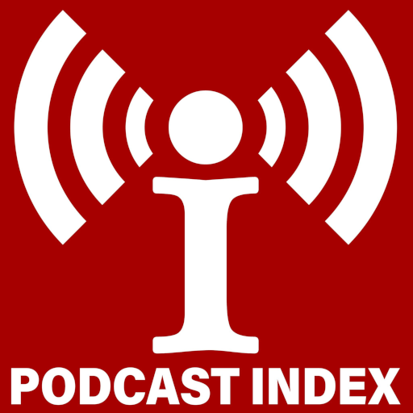

# Podcast Index Provider { width=70 align=right }

Music Assistant has support for streaming podcasts from the [Podcast Index](https://podcastindex.org/). Contributed and maintained by [Gavin](https://github.com/ozgav)

!!! tip "Donate"
    This provider exists due to the generosity of donators. Why not consider becoming one? [{ width=128 }](https://podcastindex.org/)

## Features

|           |                     |
|:-----------------------|:---------------------:|
| Subscription FREE | Yes |
| Self-Hosted Local Media   | No |
| Media Types Supported | Podcasts |
| [Recommendations](../ui.md#view-home) Supported | No |
| Lyrics Supported | No |
| [Radio Mode](../ui.md#track-menu) | No |
| Maximum Stream Quality | Lossy, Variable Quality |
| Login Method | None |

### Other

- Search and Browse supported

## Configuration

- You need to get an API key and secret from https://api.podcastindex.org/signup

### Settings

- <b>API Key</b> Enter your API key here
- <b>API Secret</b> Enter your API secret here

## Known Issues / Notes

- There may be podcasts in this index which don't work

## Not Yet Supported

- Nil
