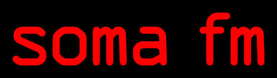

# SomaFM Radio Provider { width=70 align=right }

Music Assistant has support for [SomaFM Radio](https://somafm.com/) which allows easy addition of their radio stations to Music Assistant. Contributed and maintained by [@macegr](https://github.com/macegr)

!!! tip "Donate"
    SomaFM Radio has no ads or subscription, relying on listener donations to keep running for over 25 years. If you enjoy using this Music Assistant provider, please consider donating at https://somafm.com/support or purchasing something from https://somafm.com/store.

## Features

|           |                     |
|:-----------------------|:---------------------:|
| Subscription FREE | Yes |
| Self-Hosted Local Media | No |
| Media Types Supported | Radio |
| [Recommendations](../ui.md#view-home) Supported | No |
| Lyrics Supported | No |
| [Radio Mode](../ui.md#track-menu) | No |
| Maximum Stream Quality | AAC 130kbps (16 bit, 44.1 kHz) |
| Login Method | None |

## Configuration

- Quality can be set to Highest, High, or Low in Advanced Settings (default Highest)

## Usage

- When the SomaFM Radio provider is added, it will populate the Radio tab with all available SomaFM stations.