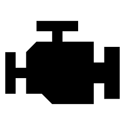
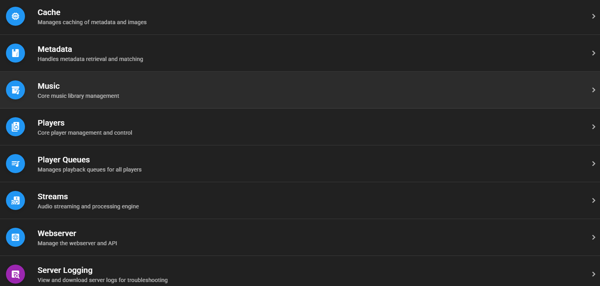
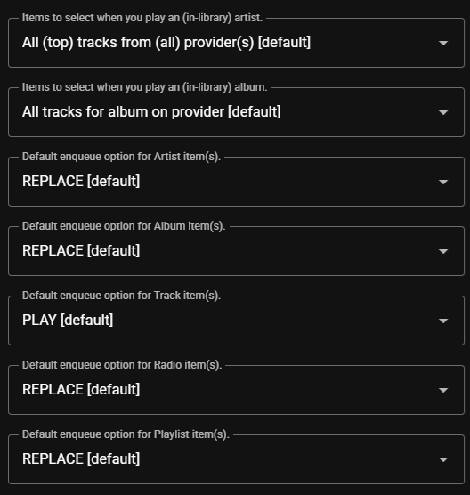
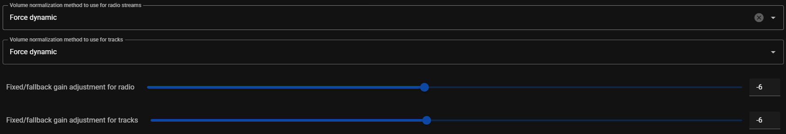

# MA Server Settings { width=70 align=right }

The core server settings are set with typical defaults that should work for most users. However, there are settings available for each of the core controllers and these are outlined below. All controllers have a setting for the log level in the advanced section. There may be slight differences in the settings between the HA add-on and docker versions of the servers.

## Cache Controller

- A button is available to clear the cache used my Music Assistant. Do not routinely use this button as it increases [API usage](../usage.md/#online-metadata-sources) and slows down the MA experience

## Metadata Controller

- <b>Language.</b> Preferred language for metadata. If the selected language is unavailable then English will be used
- <b>Enable metadata retrieval from online metadata providers.</b> Enables the lookup of information that is not available locally. MA does not modify any existing metadata but supplements it

## Music Controller

- <b>Sync Interval.</b> The interval in minutes that all music providers are synchronized with MA
- <b>Add item to the library as soon as its played.</b> Add a track or radio station to the library when played
- <b>Advanced - Reset Library Database.</b> Selecting this button will erase the MA database. This is a destructive irreversible action! This should only be used if database corruption is confirmed. All library items including playlists stored in the database will be lost and will need to be recreated. A rescan of the music providers will rebuild the database with the information contained on those providers. Do not use this routinely. For problems with individual items use the REMOVE FROM LIBRARY menu option

## Player Queues Controller

The behaviour when playing or enqueuing items is determined by the settings in this section.

## Players Controller

- No settings are currently available beyond the log level

## Streamserver

All settings in this section should be considered advanced and will not need to be adjusted in the majority of cases. Users with complicated network setups will find settings in this section that will be useful. If MA appears to be setup correctly but no playback occurs then check the settings in this section.

### Streamserver Generic Settings

- The <b>Published IP address</b> and <b>TCP Port</b> are normally populated automatically. If there are issues with playback then confirm the IP address shown is reachable by the players on the local network. The port must be available

### Streamserver Audio Settings

This section contains settings which affect the [Volume Normalization](../faq/tech-info.md/#volume-normalization) functionality of MA. This functionality is enabled by default and settings are also available on an [individual player basis](individual-player.md/#audio). Extensive online help for these settings is available by selecting the  icon in the settings UI for each option

### Streamserver Advanced Settings

- <b>Bind to IP/interface.</b> Use in complex network setups to start the streamserver on a specific interface
- <b>Allow caching of remote/cloudbased audio streams.</b> To ensure smoother playback as well as faster seeking, MA can cache audio streams on disk. This should only be disabled on systems with limited diskspace. Select the  icon in the settings UI for more information

## Webserver (Frontend and API)

### HAOS Add-On
- <b> Expose the Webserver (port 8095).</b> For the HA add-on version of the server it runs on a protected internal network only and is accessed securely via Home Assistant's ingress service. Enabling this option allows direct access to the webserver from your local network. See [Server Usage and Notes](../installation.md/#server-notes) for the considerations before enabling this option. Never expose this port directly to the Internet

### Docker Container
- <b>Base URL.</b> The (base) URL to reach this webserver on the network. Override this in advanced scenarios where, for example, you are running the webserver behind a resverse proxy
- <b>TCP Port.</b> The port that the webserver is to be run on
- <b>Advanced-Bind to IP/Interface.</b> Start the webserver on this specific interface. For further information see the help for this setting in the MA UI
