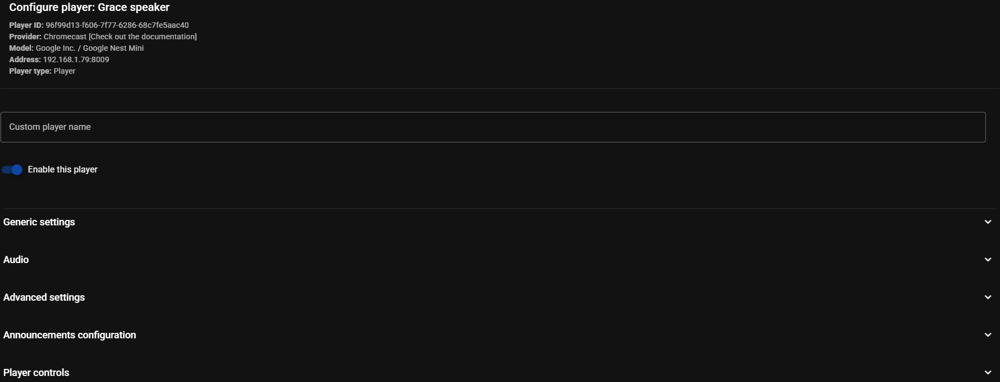
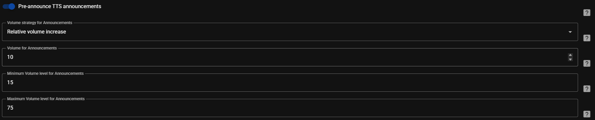

# Individual Player Settings { width=70 align=right }

Individual Player Settings are usually quite extensive. The typical headings of the various sections are shown in the following image and subsections below will expand on them. Groups have the same sections but less settings available. Not all players have all the settings listed. Reference can be made to the [Player Summary Table](../player-support/index.md) to identify some of the functionality that should be available for a given player type otherwise visit the settings page for the player. 

## Generic Settings

- <b>Icon.</b> A material design icon is used in some parts of the UI and this can be configured on a per player basis
- <b>Enable queue flow mode</b> (not available all providers). This can be used for players that do not natively support gapless and/or crossfading or if the player has trouble transitioning between tracks. Refer to the player provider page for the pros and cons associated with enabling this option
- <b>Hide this player in the UI.</b> This setting determines when the player will not be shown in the [Player List](../ui.md/#player-list). Options are `When unavailable`, `When group active`, `When synced`, `Always`, and `When powered off`
- <b>Dynamic members</b> toggle. This setting is available for [Sync and Universal Groups](../faq/groups.md). When enabled, it is then possible to add and remove members from these group types
- <b>Group members.</b> For Group player types the members of the group are configured in this field

## Audio

- <b>Enable Smart Fades.</b> This dropdown enables the crossfade transition functionality between tracks. The crossfade duration is set by the slider below. The options available are `Disabled [Default]`, `Smart Fades` or `Standard Crossfade`. Smart Fades automatically analyzes each track’s tempo and beats to create seamless, musically aligned transitions between songs. It adjusts BPM, aligns downbeats, and applies EQ-based mixing for smoother fades—falling back to standard crossfade if analysis fails. Standard crossfade smoothly overlaps the end of one song with the start of the next using a simple volume fade.
- <b>Crossfade duration.</b> This slider is enabled when crossfade is enabled in the [Audio section](#audio). The default setting is 8 seconds
- <b>Enable Volume Normalization.</b> This setting should normally remain enabled to avoid differing volume levels between tracks from different sources. Read more about this on the [Technical Information page](../faq/tech-info.md#volume-normalization). The target level is set in the [Advanced Settings](#advanced-settings)
- <b>Enable Limiting to Prevent Clipping.</b> This setting should normally remain enabled to prevent audio distortion by excessively loud peaks in a track
- <b>Output Channel Mode.</b> This setting allows for selection of which channel is sent to a player. The options are `Stereo`, `Left`, `Right`, or `Mono`
- <b>DSP Settings.</b> The button to enter the DSP settings view is in this section. The functionality of the view is described next

### DSP Settings

All providers have the option to apply [Digital Signal Processing](https://en.wikipedia.org/wiki/Digital_signal_processing) (DSP) filters to the audio stream. DSP lets you shape and refine the audio with a variety of filters. Use it to tailor the sound to a room's acoustics, compensate for speaker characteristics, and fine-tune the frequency balance to personal taste.

The DSP option is found in the MA settings for each player which means that each player has its own independently configurable DSP settings.

Individual player DSP settings will be used for playback to AirPlay, Squeezelite and Universal groups. For all other group types DSP will be disabled.

The DSP path consists of an INPUT pre-amplifier for initial gain control, followed by optional audio filters that can be added between input and output (multiple times if desired). The following filters are available:

- [Parametric Equalizer](../dsp/parametriceq.md)
- [Tone Controls](../dsp/tonecontrols.md)

The path ends with an OUTPUT stage that provides both gain control and a limiter (enabled by default) to prevent signal clipping.

The DSP settings can be enabled and disabled via a toggle which allows easy [A-B testing](https://www.youtube.com/watch?v=KefGjPYyIO4)

The line on the left of the DSP settings represents the audio path, in sequential order, from the audio file (top) to the player (bottom).

A dot on the line represents a component that changes the signal. The lack of a dot indicates that the particular component has been disabled.

Using the icons at the top of the view, the additional filters can be reordered, disabled/enabled or deleted.

## Advanced Settings

- <b>Target level for [Volume Normalization](../faq/tech-info.md#volume-normalization)</b>. The default setting of -17 should normally be left undisturbed. If this is set too high it may cause clipping. Volume Normalization is enabled and disabled in the [Audio](#audio) section
- <b>Expose this player to Home Assistant</b>. If disabled the player will not be imported into HA
- <b>Sample rates supported by this player.</b> This setting is automatically set upon player discovery but the sample rates and bit depths supported by the player can be manually set. Content with unsupported sample rates will be resampled
- <b>Output codec to use for streaming audio to the player.</b> The default is FLAC but other options are MP3, AAC or WAV.
- <b>HTTP profile used for send audio.</b> This is considered to be a very advanced setting and should only be adjusted if needed. For example, try the different options if the player stops halfway through a stream or for other playback related issues. The default differs between player types
- <b>Try to inject metadata into stream (ICY).</b> Enabling this option attempts to provide metadata to the player which can be used to show track info, even when flow mode is enabled. Not all player support this correctly, therefore, if there are issues with playback try disabling this setting.
- <b>Audio synchronisation delay correction</b>. Refer to the [Player Summary Table](../player-support/index.md) to identify which types support sync correction

## Announcements Configuration

There are a number of configurable options for controlling the volume of announcements sent to the MA players. These are well described by the help available by selecting this icon  beside each field.

## Player Controls

Each player has a number of options available to control the behaviour of the power, volume and mute controls in the MA UI. By default, if a device supports these controls then that native behaviour will be used or if the control is not supported then it will be disabled in the UI (the setting will indicate NONE). It is also possible to manually disable the controls by changing the setting to NONE.

It is possible to map other HA entities to the MA player controls. in order for this to be an option the HA entities need to be first exposed to MA via the settings in the [HA Plugin](../ha-plugin.md).

**Power** If a player does not support power but it is desired that the player has an on and off state then a FAKE option is available which will simulate the on/off functionality. 

**Mute** There is a FAKE option that will set the volume to zero and restore it when mute and unmute is commanded.

## Provider Specific Settings

Providers with unique settings are:

- [AirPlay](../player-support/airplay.md/#settings)
- [Squeezelite](../player-support/squeezelite.md/#settings)
- [Google Cast](../player-support/google-cast.md/#settings)
