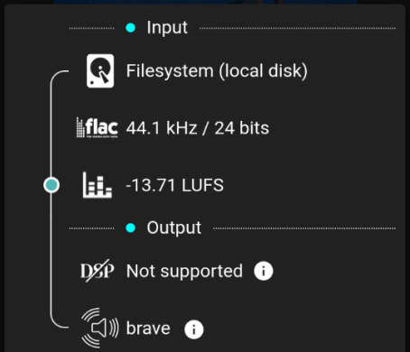
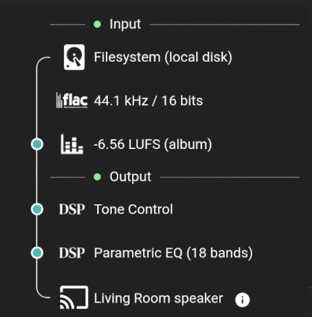
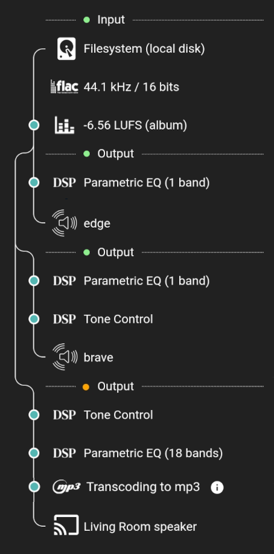

# Stream Details

## Basic View

This view shows the complete path that the audio travels. A blue dot on the line on the left shows that a modification has been made to the audio at that point.

The view begins with an Input section which shows the origin of the file and the codec, sample rate and bit depth. All tracks are processed internally as raw [PCM](https://diyodemag.com/education/what_is_pcm_pulse_code_modulation) by Music Assistant and are decoded to 32 bits floating point in the sample rate of the source. 

Next the Volume Normalization value is shown. Details about how Volume Normalization is applied can be found on the [Technical Information](faq/tech-info.md/#volume-normalization) page.

The Output section is then shown which, in this example, is simple and just shows the icon of the player provider and the name of the player.
 
MA, by default sends lossless audio to the player. The exact codec, sample rate and bit depth that are sent to the player depends on the player / provider and is not shown unless the MP3 option has been selected in the player settings. PCM could be sent to the player although typically FLAC is used to save some bandwidth. 

The maximum sample rate that can be expected can be found in the [Player Providers summary table](player-providers/index.md). This can be further limited if changes were made to the default options for the player's `Sample Rates Supported by this Player` advanced setting.
***************************************************************
## Digital Signal Processing

In this example [DSP](player-support/index.md/#dsp-settings) has been enabled. High level information about the DSP filters which have been applied are shown. A tooltip is available to explain why the DSP is disabled if that is the case.
***************************************************************
## Groups

The view will expand as necessary to show all [grouped players](faq/groups.md).
