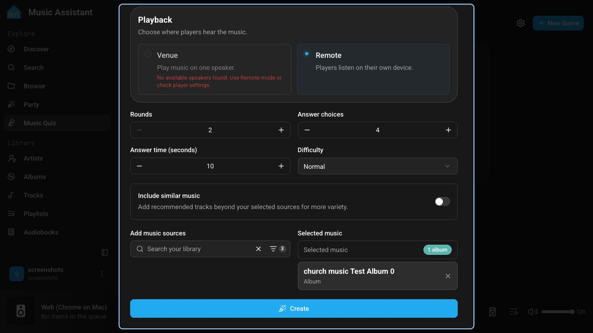
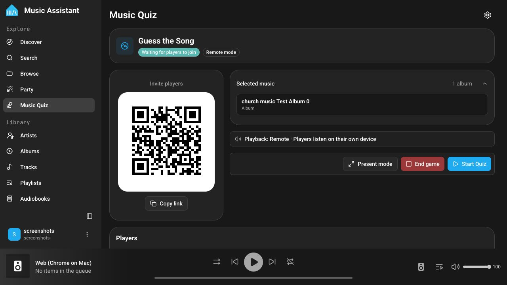
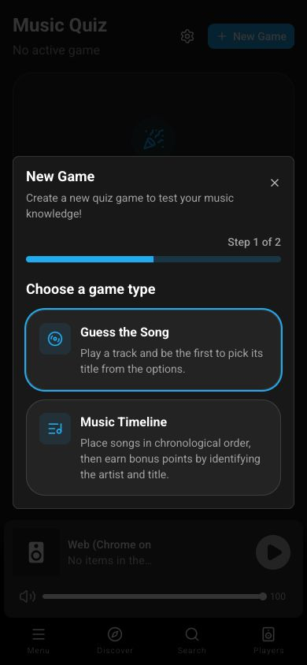
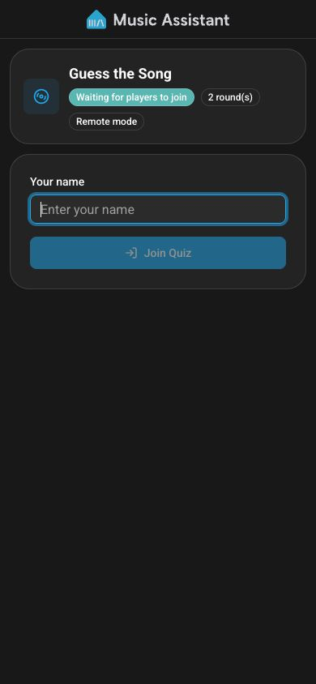
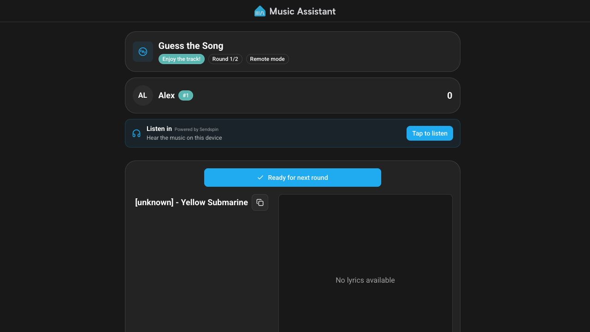
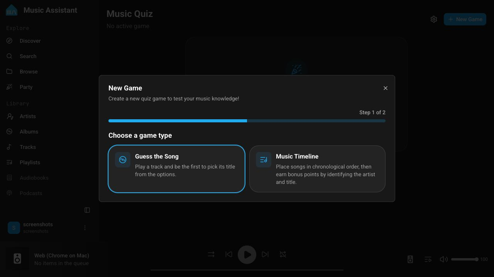
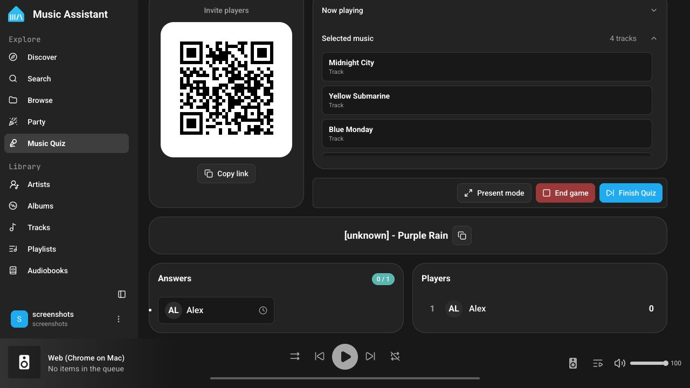
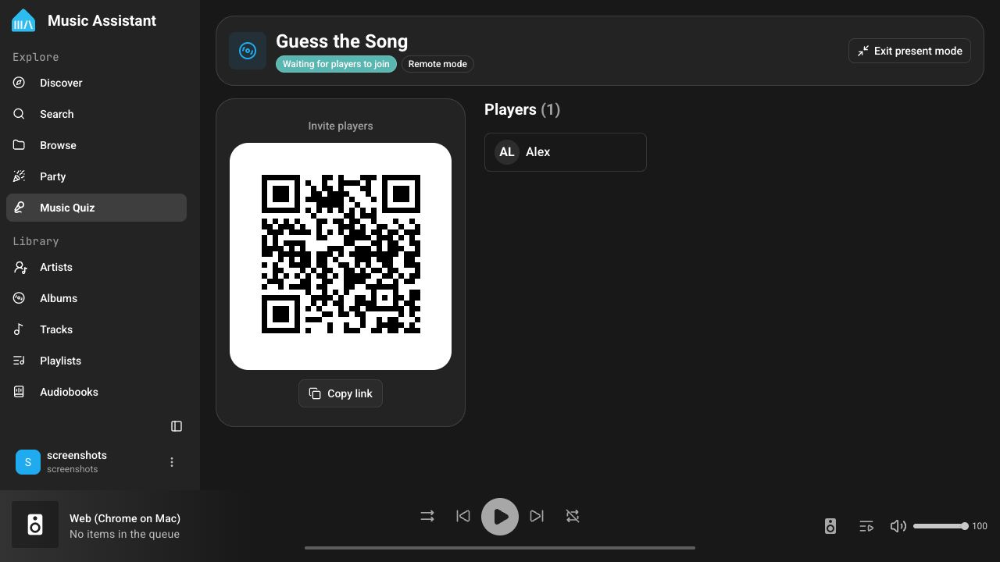
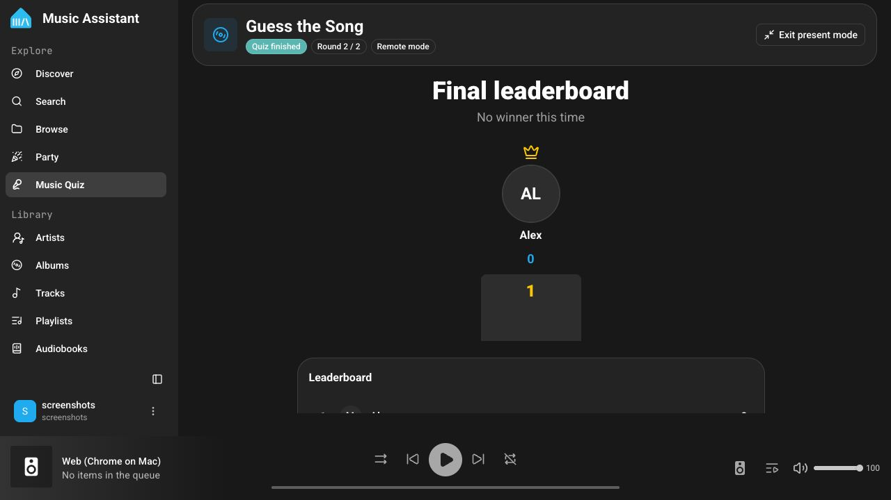

# Music Quiz Plugin

The Music Quiz plugin turns your Music Assistant library into a multiplayer quiz. Open the host dashboard on a TV, computer, or tablet, let players join by scanning a QR code, and run the game without creating accounts for your guests.

Players answer on their own phones while the dashboard shows the lobby, round progress, answers, scores, and final podium. Music can play through one shared speaker or directly on every player's device.

:::caution[Experimental]
Music Quiz is experimental. Its game types, settings, and behavior may change between Music Assistant releases.
:::

## Features

- QR-code guest access with no guest accounts or app installation required
- A host dashboard with round controls, live player progress, leaderboards, and a final podium
- Full-screen **Present mode** for a TV or other shared display
- **Venue mode** for playback through one Music Assistant player
- **Remote mode** for silent-disco-style playback on every player's device
- Three game types: **Guess the Song**, **Music Timeline**, and AI-generated **Music Trivia**
- Select tracks, playlists, albums, artists, and library genres as quiz sources
- Optional similar-music expansion for more varied rounds
- Automatic answer deadlines, early reveal when everyone finishes, and player-ready progression
- Optional synchronized lyrics during the Guess the Song reveal
- Replay the same setup and player group or create a different game
- Remote Access support for players who are not on the same local network

## Requirements

- At least one configured music source containing playable tracks
- For **Venue mode**, an available, enabled Music Assistant player, stereo pair, or group
- For **Remote mode**, the Sendspin provider must be available; each player also needs a device and browser that can play web audio
- For **Music Timeline**, enough unique tracks with usable release years: one initial anchor plus one track per configured round
- For **Music Trivia**, a configured plugin that supports AI queries, such as the Home Assistant plugin with LLM access, and enough selected tracks with usable metadata

:::note
Music Trivia is only shown in the game picker when a compatible AI plugin is loaded. Guess the Song and Music Timeline do not require AI.
:::

## How it works

### For the host

1. Go to **Settings → Plugins → Add a Plugin** and add **Music Quiz**.
2. Open **Music Quiz** from the Music Assistant sidebar.
3. Select **New Game**, choose a game type, and configure playback, rounds, answer time, and music sources.
4. Create the game and display the QR code. Use **Present mode** for a full-screen lobby and scoreboard.
5. Wait for players to join, then select **Start Quiz**.
6. Use the host controls to reveal an answer early, move to the next round, finish the quiz, or end the game.

Only users with permission to invite users can create and control a game. Music Quiz is single-instance and runs one game at a time.

### For players

1. Scan the QR code with the phone's camera or open the copied join link.
2. Enter a unique display name and select **Join Quiz**.
3. In Remote mode, tap **Listen in** if browser audio does not start automatically.
4. Submit an answer before the countdown ends. An answer is locked after submission.
5. Review the answer and points during the reveal, then select **Ready for next round** when ready.
6. Follow the live leaderboard until the final scores and podium appear.

A player who joins after a round has started can watch that round and begins answering from the next round.

| Create a game on a phone | Join from a phone |
|---|---|
|  |  |

## Game types

### Guess the Song

A track starts playing and players select its title from a set of choices. The answer reveal shows the song, artwork, individual result, points, and lyrics when available.

| Setting | Default | Range | Description |
|---|---:|---:|---|
| **Rounds** | 5 | 2–50 | Number of songs in the game. A track is not reused within the same game. |
| **Answer choices** | 4 | 2–8 | Number of possible answers shown each round. |
| **Answer time** | 30 seconds | 5–120 seconds | Maximum time to answer. If a track is shorter, its duration limits the answer window. |
| **Difficulty** | Normal | Easy / Normal / Hard | Changes how plausible the incorrect answers are. Easy favors random tracks from the selected sources; Normal favors catalog matches; Hard favors similar tracks and artists. |

### Music Timeline

Players listen to a hidden song and place it into a growing chronological timeline. The first round starts with an automatically selected anchor song. After placing the new song, players can optionally identify its artist and title for bonus points.

| Setting | Default | Range / options | Description |
|---|---:|---:|---|
| **Rounds** | 5 | 1–100 | Number of songs players place. The source pool needs at least this many dated tracks plus one anchor. |
| **Answer time** | 30 seconds | 1–300 seconds | Maximum time to place the song and complete any enabled bonuses. |
| **Artist bonus** | Off | Off / Free text / Multiple choice | Adds an optional artist question after a correct placement. |
| **Title bonus** | Off | Off / Free text / Multiple choice | Adds an optional song-title question after a correct placement. |

Bonus questions are offered only after a correct placement. Players may answer them or select **Skip remaining bonuses**.

### Music Trivia

Music Trivia asks AI-worded questions grounded in the title, artist, album, or release-year metadata of tracks from your selected sources. Music Assistant chooses the fact and validates the generated question and incorrect answers; the AI does not decide the correct answer.

| Setting | Default | Range / options | Description |
|---|---:|---:|---|
| **Rounds** | 5 | 1–100 | Number of questions. The source pool needs at least one unique track with usable metadata per round. |
| **Answer choices** | 4 | 2–8 | Number of possible answers shown for each question. |
| **Answer time** | 30 seconds | 1–300 seconds | Maximum time to answer. |
| **Difficulty** | Normal | Easy / Normal / Hard | Instructs the AI to adjust the wording and plausibility of incorrect answers. |
| **Question language** | Current UI language | Available UI languages | Language used for generated question text and incorrect answers. Proper names remain unchanged. |
| **Play revealed songs** | On | On / Off | Plays the track behind the question after the correct answer is revealed. |

When reveal audio is enabled, players can use **Listen in** and the selected venue speaker or remote devices play the grounded track during the reveal. Trivia advances automatically after 15 seconds unless everyone marks themselves ready sooner.

## Playback modes

Playback is selected while creating each game. Music Assistant remembers the last successful mode and venue player as the defaults for the next game.

### Venue mode

Venue mode plays quiz audio through one selected Music Assistant player, stereo pair, or group so everyone in the room hears the same stream. Only enabled, available, visible, fully configured native players are offered.

Players may also see **Listen in** on their own device. This depends on whether the selected playback session can attach that web player; the room speaker remains the primary output.

### Remote mode

Remote mode creates a Sendspin playback session and sends quiz audio to each player's web player. This is useful for silent-disco games or players in different locations. Each player should tap **Listen in** and keep the quiz page open so the browser can continue playing audio.

:::tip
Phone browsers commonly require a user gesture before playing sound. Asking everyone to join and tap **Listen in** before the host starts avoids missing the beginning of the first round.
:::

## Music sources

Every game requires at least one source. The source picker supports:

- Tracks
- Playlists
- Albums
- Artists
- Genres from the Music Assistant library

Music Assistant combines the tracks from all selected sources, removes duplicates, and randomly chooses unused tracks for the rounds. Choose sources with more unique tracks than the configured round count so unplayable items or missing metadata do not prevent the game from being created or continued.

### Include similar music

Enable **Include similar music** to extend the selected pool with playable recommendations related to your sources. This provides more variety than the exact albums, artists, playlists, genres, or tracks you selected. When compatible radio/similar-track support is unavailable, Music Quiz continues with the selected sources only.

For predictable games, especially a carefully themed quiz, leave this option disabled.

## Plugin configuration

The Music Quiz provider settings contain one optional enhancement:

| Setting | Default | Description |
|---|---:|---|
| **Enhance the Experience with AI** | Off | Lets compatible AI providers generate more convincing fake answers where supported. It currently enhances Hard Guess the Song distractors and Music Timeline multiple-choice bonuses. Built-in answer generation remains the fallback if AI is unavailable or returns an unusable response. |

This setting is separate from Music Trivia. Trivia always requires an AI-query provider because its questions are generated for each game.

## Game flow and host controls

| Phase | What happens |
|---|---|
| **Lobby** | The QR code, player list, game type, and playback mode are shown. The host starts the game. |
| **Answering** | The countdown runs and answers are locked as they are submitted. The host can reveal early; the server also reveals when time expires or all active players finish. |
| **Reveal** | The correct answer, per-round points, and leaderboard are shown. Players can mark themselves ready. The host can advance manually, and the game advances early when all active players are ready. |
| **Finished** | The winner, podium, and final leaderboard are shown. The host can replay the same game or set up a new one. |

After **Play again**, scores and rounds are reset but the settings and joined players are retained. If at least one player is still connected, the replay starts automatically after a 30-second lobby countdown; the host can start it immediately.

Selecting **End game** removes the game for every player and stops its playback session.

## Scoring

### Guess the Song and Music Trivia

Only correct answers score. Correct players are ordered by submission time: the fastest receives 1,000 points and the remaining correct answers receive linearly decreasing points. Incorrect or missing answers receive no points.

### Music Timeline

A correct placement uses the same speed-based scale, with the fastest correct placement receiving 1,000 points. Each correct enabled bonus answer adds 250 points. Bonus points are available only when the timeline placement itself is correct.

The leaderboard updates after every reveal. Equal total scores share the same rank, and equal top scores produce joint winners.

## Present mode

Select **Present mode** from the host controls to open the TV-friendly full-screen layout. It shows:

- The join QR code and player list in the lobby
- The current question or hidden-song state during answering
- Answer progress without exposing the correct answer early
- The revealed answer and live leaderboard
- The final podium and scores

Exiting browser full-screen also exits Present mode. Host controls remain in the regular dashboard, so keep another administrator device available if the presentation screen is not convenient to control.

## Remote Access

When [Remote Access](/settings/remote-access) is enabled, the QR code uses `app.music-assistant.io` and players can join through WebRTC from outside the local network.

When Remote Access is disabled, the join link uses the Music Assistant server's local address and players must be able to reach that address, normally by joining the same network.

## Known issues and notes

- Music Quiz supports up to 100 joined players. Display names are limited to 40 characters and must be unique, ignoring capitalization.
- A disconnected player is kept for a 60-second reconnect grace period. After that, the player is removed from an active game and can join again.
- Guest join codes expire after 8 hours. Reloading an already joined page continues to use its issued guest session while that session remains valid.
- Some phone browsers suspend background tabs or block audio until the page is tapped. Keep the quiz visible and use **Listen in** again if audio stops.
- Music Timeline ignores tracks without a usable release year. Compilation or incomplete metadata can also make tracks unsuitable for Trivia.
- A player who joins during a round cannot answer until the following round.
- The Music Quiz dashboard requires a compatible frontend. If guests see **Update required**, update or reload the Music Assistant frontend.

### Opening the QR link on a signed-in device

The QR code issues a guest token and stores it in the browser. Opening it in the same browser profile that you use to administer Music Assistant replaces the existing signed-in session and redirects that browser to the guest interface.

Open the join link on the player's own device or in a private/incognito window. Do not open it in the normal browser profile used for the host dashboard.

To recover a browser that is stuck in guest mode, open the browser's developer tools on the Music Assistant page, run `localStorage.clear()` in the Console, and reload the page. The normal login screen will appear again.

## Hosting tips

1. Use a TV or large monitor for Present mode and a separate phone or laptop for host controls.
2. Test the selected speaker or Remote mode before inviting players.
3. Start with four answer choices and a 30-second timer, then shorten the timer for experienced groups.
4. Select sources with consistent, complete title, artist, and release-year metadata for better answers.
5. Use playlists or genres for a broad game, or a small set of albums and artists for a themed quiz.
6. Enable Remote Access when players may use cellular data or join from another location.
