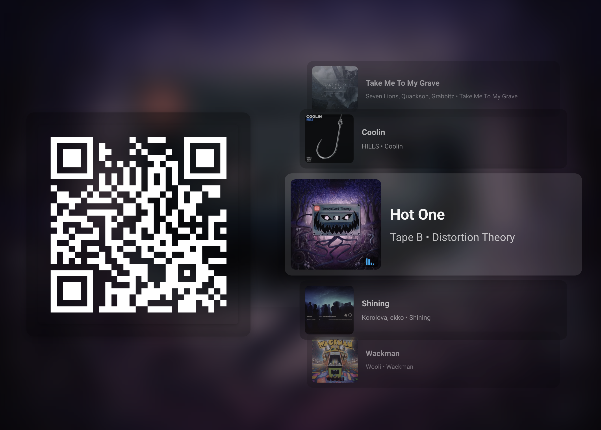
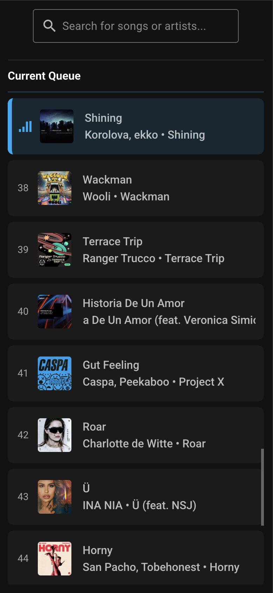
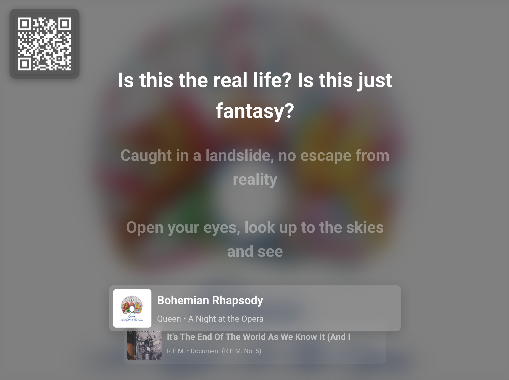
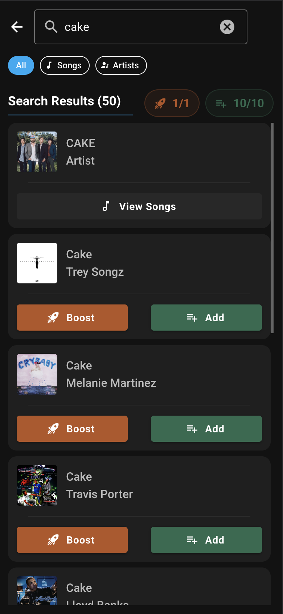

# Party Plugin

The Party plugin lets your guests add their favorite songs to the queue just by scanning a QR code, no logins or accounts needed! Just display the party dashboard on a TV or device of your choice. Guests have a dedicated UI page with no access to your system controls. With optional rate limits you can keep things fair.

## Features

- **Guest Access via QR Code** - Generate a shareable QR code that guests scan to access the song request interface
- **Mobile-Optimized Guest View** - Clean, touch-friendly interface designed for phones
- **Search & Request Songs** - Guests can search your music library and streaming services
- **Configurable Rate Limiting** - Token-based system prevents queue flooding
- **Party Dashboard** - Display the queue and QR code on a TV, monitor, or tablet
- **Lyrics Display** - Show synchronized lyrics on the dashboard alongside the QR code
- **Karaoke Mode** - Prioritize lyrics front-and-center for a karaoke-style experience
- **Remote Access Support** - Works with Music Assistant's remote access so guests don't even need to be connected to your local network or wifi

## How It Works

### For the Host

1. Enable the Party plugin in Music Assistant settings
2. Configure which player will be used for party
3. Open the Party dashboard on the screen of your choice to display the live queue and guest join QR code.

### For Guests

1. Scan the QR code with a phone camera
2. The guest view opens automatically in a browser
3. Search for songs by name or artist
4. Tap a song to reveal actions, then tap "Request" to add to the queue or "Boost" to play sooner
5. Tap an upcoming song in the queue to boost it higher
6. View the current queue and see when their songs will play

## Configuration

### Basic Settings

| Setting | Description |
|---------|-------------|
| **Enable Guest Access** | Master toggle for the entire feature. When disabled, all active guest sessions are immediately destroyed and guests will need to re-scan the QR code when re-enabled. |
| **Party Player** | Select which player/queue receives guest requests. If not set, uses the active player. |
| **Display Lyrics** | Show synchronized lyrics on the party dashboard alongside the QR code. When synced (LRC) lyrics are available, they scroll in time with the music. Hidden on mobile-sized screens in normal mode. |
| **Karaoke Mode** | When enabled (requires Display Lyrics), lyrics are displayed prominently in the center of the screen with the track list minimized to the current and next song at the bottom. The QR code moves to the top-left corner. On mobile, the QR code is hidden and lyrics fill the screen with only the current song shown at the bottom. |
| **Highlight Lyrics Ahead** | When enabled (requires Display Lyrics), the lyric line highlight transition finishes exactly when the line's timestamp arrives, giving a smooth anticipation effect. When disabled, the transition starts at the timestamp instead. Enabled by default. |
| **Anti Burn-in** | Periodically swaps the position of UI elements every 10 minutes to prevent burn-in on OLED or plasma displays. In normal mode, the QR code and track list sides are swapped. With lyrics enabled, the QR code and lyrics swap positions. In karaoke mode, the QR code alternates between the top-left and top-right corners. Enabled by default. |

### Rate Limiting (Advanced)

Rate limiting uses a "token bucket" system. Each guest has a pool of tokens that refill over time. When tokens run out, they must wait for them to refill.

!!! tip "Disabling Rate Limiting"
    Set "Enable Rate Limiting" to off to give guests unlimited requests. Individual features (Add, Boost, Skip) can still be disabled separately.

#### Add to Queue

| Setting | Default | Description |
|---------|---------|-------------|
| **Allow Add to Queue** | On | Let guests add songs the queue (prioritized before normally added songs, but after any "Boost" songs) |
| **Token Limit** | 10 | How many songs a guest can add before waiting |
| **Refill Rate** | 2 min | Time to regenerate one token |

#### Boost

| Setting | Default | Description |
|---------|---------|-------------|
| **Allow Boost** | On | Let guests boost songs to play next (queue jumping). Guests can boost from search results or tap an upcoming queue item to boost it higher. |
| **Token Limit** | 3 | How many "Boost" requests before waiting |
| **Refill Rate** | 20 min | Time to regenerate one token |

#### Skip Song

| Setting | Default | Description |
|---------|---------|-------------|
| **Allow Skip Song** | On | Let guests skip the currently playing song |
| **Token Limit** | 1 | How many skips before waiting |
| **Refill Rate** | 60 min | Time to regenerate one token |

### Badge Colors (Advanced)

Customize the colors of badges shown on guest-requested songs in the queue:

- **Request Badge Color** - For songs added to the queue (default: Blue)
- **Boost Badge Color** - For priority requests (default: Orange)

## User Interface

### Party Dashboard

Access via `/party` in the Music Assistant interface. This view is designed for display on a TV or monitor at your party.

**Features:**

- Large QR code for easy scanning (click to copy the party URL to clipboard)
- Animated track stack showing previous, current, and upcoming songs
- Guest request badges visible on queue items
- Optional synchronized lyrics display alongside the QR code
- **Karaoke Mode** - A dedicated layout that puts lyrics front-and-center with the track stack minimized at the bottom and the QR code in the top-left corner. Great for sing-along parties!
- **Anti Burn-in** - Automatically swaps UI element positions every 10 minutes to protect OLED and plasma displays
- Access error display when the configured player is not available

### Guest View (Mobile Interface)

Guests are automatically redirected here after scanning the QR code.

**Features:**

- Search bar with filter chips (All / Songs / Artists)
- Smart search ranking using relevance and popularity
- Tap-to-expand interaction — tap a track in search results to reveal "Request" and "Boost" action buttons
- Artist drill-down to browse an artist's tracks
- Current queue display with position indicators
- Tap upcoming queue items to boost them higher in the queue
- Token counters showing remaining requests
- "Request" and "Boost" badges on songs they've added
- **Skip button** - When enabled by the host, guests can skip the currently playing song. The button appears next to the "Current Queue" header with a token counter showing remaining skips. Once tokens are used, a countdown timer shows when the next skip becomes available

## Remote Access

When [Remote Access](../settings/remote-access.md) is enabled, the QR code URL uses `app.music-assistant.io`, allowing guests to connect from anywhere via WebRTC - even if they're not on your local network.

When remote access is disabled, guests must be on the same network as your Music Assistant server.

## Known Issues / Notes

- Guest sessions expire after 8 hours and require a new QR code scan (but refreshes if the session is used before it expires)
- The guest user shares a single "guest" account - individual guest tracking is not available
- When the plugin is disabled or removed, all active guest sessions are immediately revoked
- Rate limiting tokens are stored in the guest's browser - clearing browser data resets their limits
- The Party Dashboard works best on landscape displays; the guest view is optimized for portrait (mobile)

## Tips for Hosting

1. **Display the Party Dashboard** - Use a spare tablet, TV, or monitor to show the QR code and queue
2. **Pre-populate the queue** - Add some songs before guests arrive to set the mood
3. **Adjust rate limits** - For smaller gatherings, you might disable rate limiting entirely
4. **Use a dedicated player** - Configure a specific player for party to avoid conflicts with other rooms
5. **Enable remote access** - If some guests might be on cellular data, enable remote access so the QR code works for everyone
6. **Enable Karaoke Mode** - For sing-along parties, turn on Display Lyrics and Karaoke Mode to show lyrics prominently on the big screen. Works best with music providers that supply synced (LRC) lyrics
