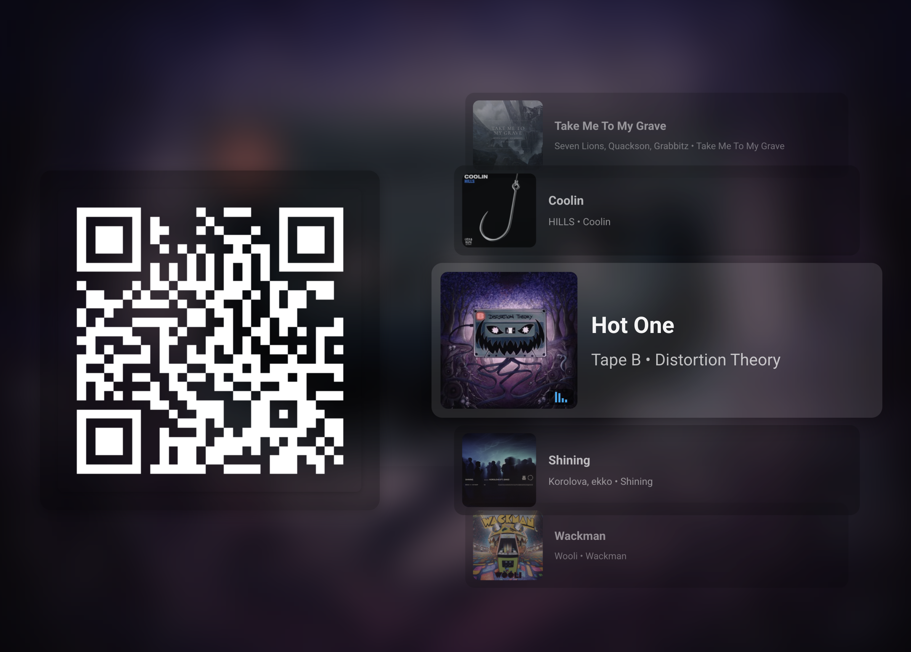
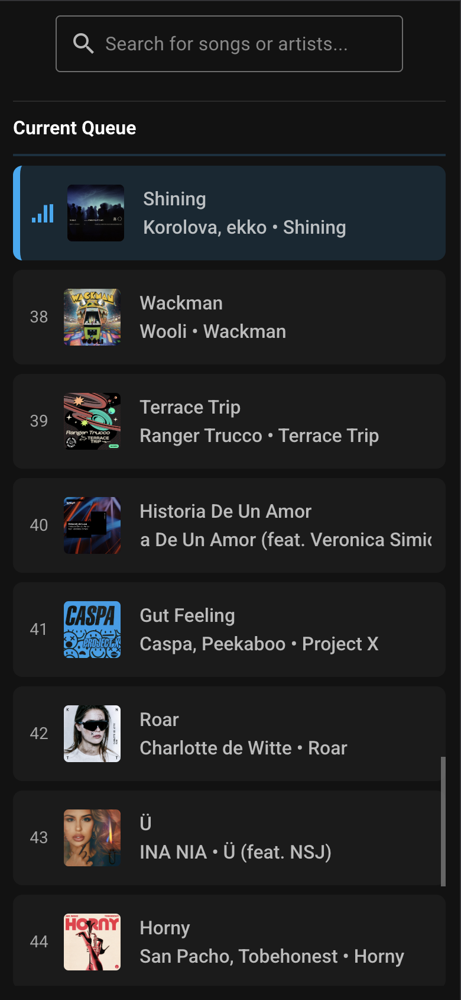
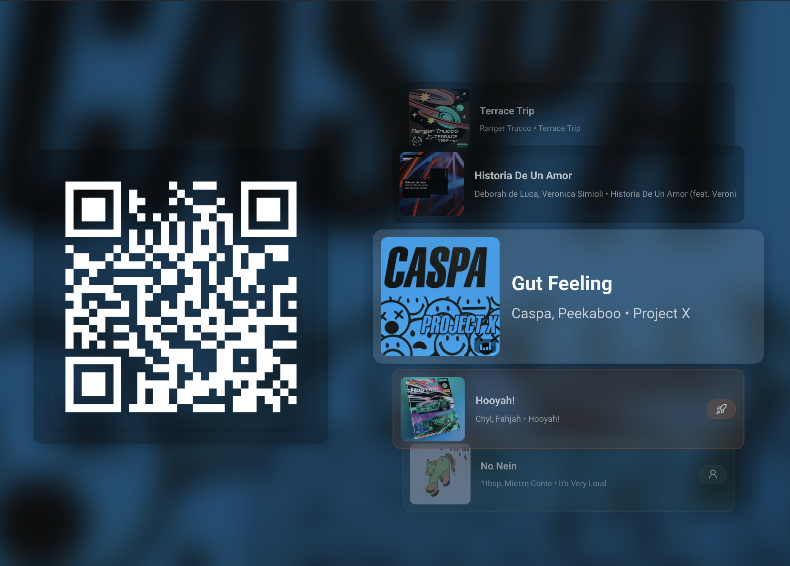
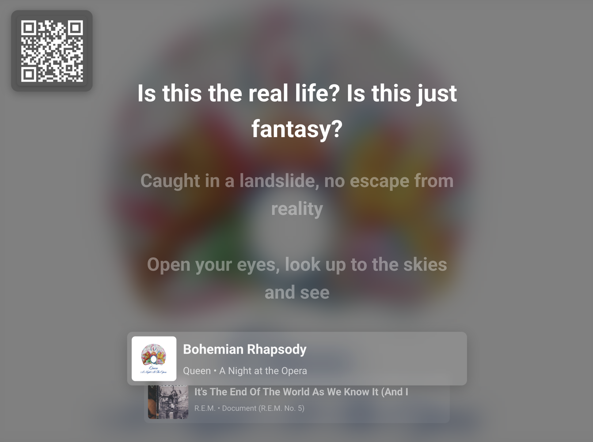
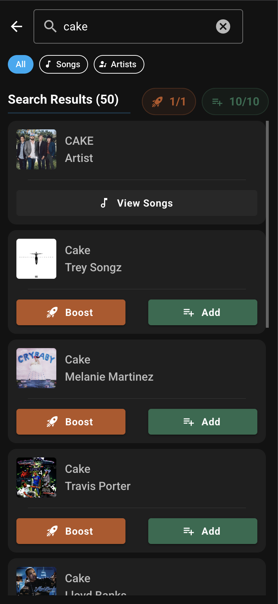

# Party Plugin

The Party plugin lets your guests add their favorite songs to the queue just by scanning a QR code, no logins or accounts needed! Just display the party dashboard on a TV or device of your choice. Guests have a dedicated UI page with no access to your system controls. With optional rate limits you can keep things fair.

## Features

- **Guest Access via QR Code** - Generate a shareable QR code that guests scan to access the song request interface
- **Mobile-Optimized Guest View** - Clean, touch-friendly interface designed for phones
- **Search & Request Songs** - Guests can search your music library and streaming services
- **Duplicate Prevention** - Tracks already in the queue are shown as "Already in queue" and cannot be re-added
- **Configurable Rate Limiting** - Give each guest a set number of requests so nobody can take over the queue
- **Party Dashboard** - Display the queue and QR code on a TV, monitor, or tablet
- **Karaoke Mode** - Show synchronized lyrics front-and-center on the dashboard for a sing-along
- **Silent Disco** - Let every guest listen on their own phone instead of playing out loud on a speaker
- **Remote Access Support** - Works with Music Assistant's remote access so guests don't even need to be connected to your local network or wifi

## How It Works

### For the Host

1. Enable the Party plugin via **Settings → Plugins → Add a plugin**
2. Choose whether the music plays on a speaker or on each guest's phone, and in Venue mode which player will be used for party (or leave on Auto to use the last active player)
3. Open the Party dashboard on the screen of your choice to display the live queue and guest join QR code

### For Guests

1. Scan the QR code with a phone camera
2. The guest view opens automatically in a browser
3. Search for songs by name or artist
4. Pick a song from the search results, then tap "Request" to add it to the queue or "Boost" to play it sooner
5. Songs already in the queue are marked as "Already in queue" and successfully requested songs show "Added"
6. Tap an upcoming song in the queue to boost it higher
7. View the current queue and see when their songs will play

## Configuration

### Basic Settings

| Setting | Description |
|---------|-------------|
| **Party Mode** | How the party is heard. **Venue** plays the music out loud on one of your players for everyone in the room. **Remote** makes it a silent disco, where every guest listens on their own phone by tapping **Tap to listen** on the guest page. Venue by default. |
| **Party Player** | Select which player/queue receives guest requests. Set to "Auto" to automatically use the last active player. Only shown in Venue mode. |
| **Party Name** | Custom name/title displayed on the party dashboard. Leave blank to hide. |
| **Party Duration (hours)** | How long the QR code and join link stay valid, from 1 to 168 hours. 8 hours by default. A change only applies to QR codes created after it, so it does not extend the one already on screen. |
| **Enable Guest Access via QR Code** | Master toggle for the entire feature. When disabled, all active guest sessions are immediately destroyed and guests will need to re-scan the QR code when re-enabled. |
| **QR Code Text** | Custom text displayed alongside the QR code on the dashboard. Leave blank to hide. |
| **Hide Back Button in Fullscreen Mode** | Hides navigation elements in fullscreen mode. You will need to use browser controls (e.g. Alt+Left) to navigate back. |
| **Show Progress Bar for the current playing song** | Display a progress bar on the currently playing song in the track list. |
| **Karaoke Mode** | Shows synchronized lyrics prominently in the center of the screen, with the track list minimized to the current and next song at the bottom. When synced (LRC) lyrics are available, they scroll in time with the music. The QR code moves to the top-left corner. On mobile, the QR code is hidden and lyrics fill the screen with only the current song shown at the bottom. |
| **Highlight Lyrics Ahead of Time** | When enabled (requires Karaoke Mode), the lyric line highlight transition finishes exactly when the line's timestamp arrives, giving a smooth anticipation effect. When disabled, the transition starts at the timestamp instead. Enabled by default. |
| **Enable Anti Burn-in** | Periodically swaps the position of UI elements every 10 minutes to prevent burn-in on OLED or plasma displays. In normal mode, the QR code and track list sides are swapped. In karaoke mode, the QR code alternates between the top-left and top-right corners. Enabled by default. |

### Rate Limiting (Advanced)

Each guest gets an allowance of goes, and they earn another one back every so often. Once a guest has used them all up they have to wait for one to come back before they can do that again. Adding songs, boosting and skipping each have their own allowance, so running out of skips does not stop someone adding a song.

The **Token Limit** is how many goes a guest starts with, and how many they can save up. The **Refill Rate** is how long it takes to earn one back.

:::tip[Disabling Rate Limiting]
Set "Enable Rate Limiting" to off to give guests unlimited requests. Individual features (Add, Boost, Skip) can still be disabled separately.
:::

#### Add to Queue

| Setting | Default | Description |
|---------|---------|-------------|
| **Allow Add to Queue** | On | Let guests add songs to the queue (prioritized before normally added songs, but after any "Boost" songs) |
| **Prevent Duplicate Tracks** | On | Prevent guests from adding a track that is already in the queue. Tracks already queued are shown as "Already in queue" in the guest view. |
| **Add to Queue Token Limit** | 10 | How many songs a guest can add before having to wait, from 1 to 50 |
| **Add to Queue Refill Rate (minutes)** | 2 min | How long until they earn another go, from 1 to 60 minutes |

#### Boost

| Setting | Default | Description |
|---------|---------|-------------|
| **Allow Boost** | On | Let guests boost songs to play next (queue jumping). Guests can boost from search results or tap an upcoming queue item to boost it higher. |
| **Boost Token Limit** | 1 | How many boosts a guest can use before having to wait, from 1 to 10 |
| **Boost Refill Rate (minutes)** | 20 min | How long until they earn another go, from 5 to 120 minutes |

#### Skip Song

| Setting | Default | Description |
|---------|---------|-------------|
| **Allow Skip Song** | Off | Let guests skip the currently playing song |
| **Skip Song Token Limit** | 1 | How many skips a guest can use before having to wait, from 1 to 5 |
| **Skip Song Refill Rate (minutes)** | 60 min | How long until they earn another go, from 15 to 180 minutes |

### Badge Colors (Advanced)

Customize the colors of badges shown on guest-requested songs in the queue:

- **Request Badge Color** - For songs added to the queue (default: Green)
- **Boost Badge Color** - For priority requests (default: Orange)

## User Interface

### Party Dashboard

Access via the Party link in the Music Assistant sidebar. This view is designed for display on a TV or monitor at your party.

**Features:**

- Large QR code for easy scanning. Click it, or the **Copy link** button below it, to copy the join link. On devices that can share, the button is **Share invitation** instead, with Copy link in its menu
- Animated track stack showing previous, current, and upcoming songs
- Guest request badges visible on queue items
- **Karaoke Mode** - A dedicated layout that puts synchronized lyrics front-and-center with the track stack minimized at the bottom and the QR code in the top-left corner. Great for sing-along parties!
- **Anti Burn-in** - Automatically swaps UI element positions every 10 minutes to protect OLED and plasma displays
- Access error display when the configured player is not available

### Guest View (Mobile Interface)

Guests are automatically redirected here after scanning the QR code.

**Features:**

- Search bar that shows results as you type, with a filter button to limit them to Tracks or Artists
- Pick a track from the results to show its "Request" and "Boost" buttons
- Pick an artist to browse their tracks, then tap a track to show its "Request" and "Boost" buttons
- Tracks already in the queue show "Already in queue" instead of action buttons; successfully requested songs show "Added"
- Current queue display with position indicators
- Tap upcoming queue items to boost them higher in the queue
- Token counters showing remaining requests
- "Request" and "Boost" badges on songs they've added
- **Skip button** - When enabled by the host, guests can skip the currently playing song. The button appears next to the "Current Queue" header with a token counter showing remaining skips. Once tokens are used, a countdown timer shows when the next skip becomes available

## Remote Access

When [Remote Access](/settings/remote-access) is enabled, the QR code URL uses `app.music-assistant.io`, allowing guests to connect from anywhere via WebRTC - even if they're not on your local network.

When remote access is disabled, guests must be on the same network as your Music Assistant server.

## Known Issues / Notes

- The QR code stops working after the Party Duration (8 hours unless you change it). Once a guest has joined, their session lasts up to 24 hours and then they need to scan the QR code again
- Switching guest access off or removing the Party plugin signs all guests out and stops the QR code from working
- Rate limiting tokens are stored in the guest's browser - clearing browser data resets their limits
- The Party Dashboard works best on landscape displays; the guest view is optimized for portrait (mobile)

### Opening the QR link on a signed-in device

If you open the QR code or join link in a browser that is already signed in to Music Assistant, you stay signed in as yourself and land on the guest page. Tap the icon at the top right and choose **Back to Music Assistant** to return to the full app.

Guests find **Leave guest mode** in the same menu. When a guest session ends, for example because it expired or guest access was switched off, the guest sees **Your party session has ended** with a button to scan the QR code again.

## Tips for Hosting

1. **Display the Party Dashboard** - Use a spare tablet, TV, or monitor to show the QR code and queue
2. **Pre-populate the queue** - Add some songs before guests arrive to set the mood
3. **Adjust rate limits** - For smaller gatherings, you might disable rate limiting entirely
4. **Use a dedicated player** - Configure a specific player for party to avoid conflicts with other rooms
5. **Enable remote access** - If some guests might be on cellular data, enable remote access so the QR code works for everyone
6. **Enable Karaoke Mode** - For sing-along parties, turn on Karaoke Mode to show lyrics prominently on the big screen. Works best with music providers that supply synced (LRC) lyrics
